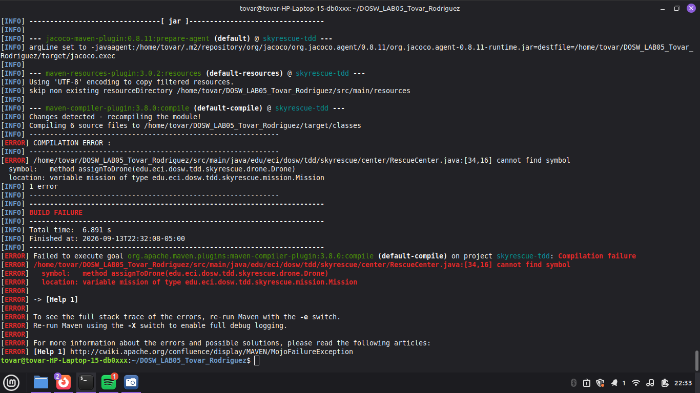
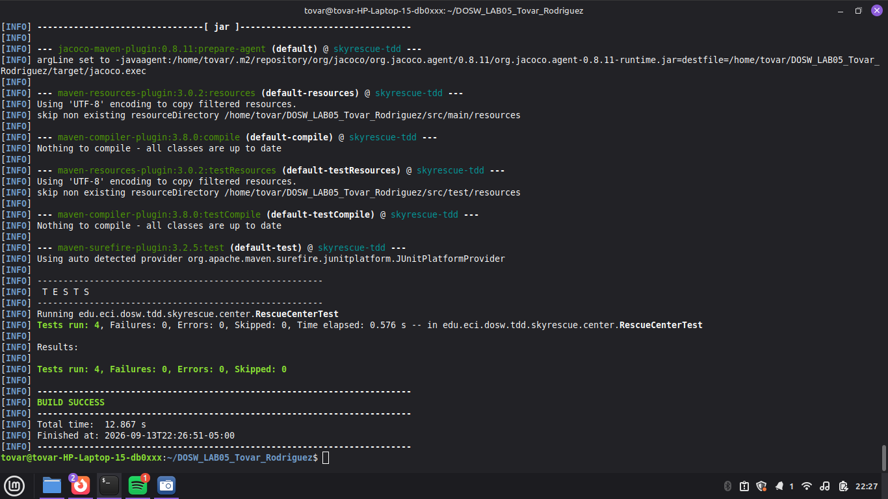
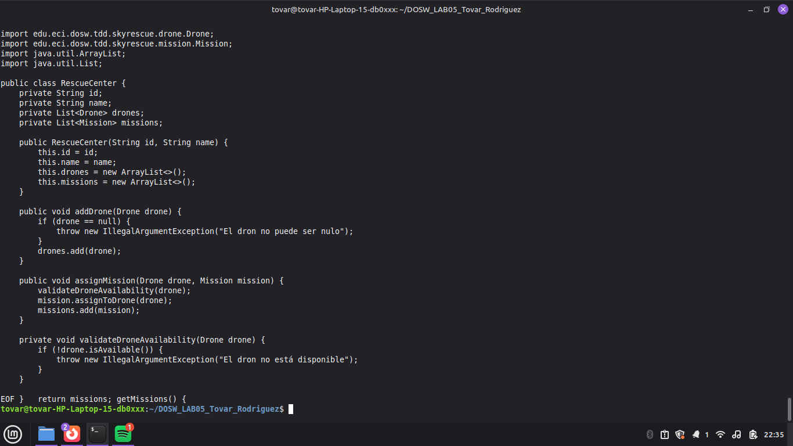
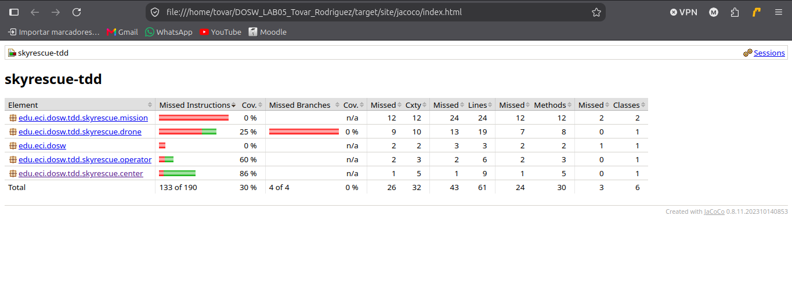
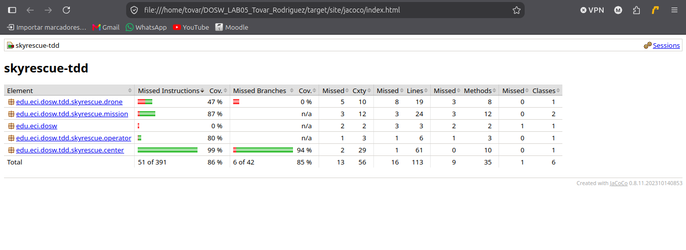

# SkyRescue - Emergency Rescue Center System

---

## Integrantes
- **Mariana Tovar**
- **Natalia Rodriguez**

## Descripcion del Proyecto
Sistema de gestion y coordinacion de emergencias con drones y operadores desarrollado en Java 21 utilizando Maven. El proyecto implementa desarrollo guiado por pruebas (TDD), medicion de cobertura de codigo con JaCoCo y analisis estatico de codigo con SonarQube.

## Descripción de SkyRescue
SkyRescue es un sistema de gestión y coordinación de misiones de rescate con drones y operadores. Permite registrar centros de rescate, asignar misiones a drones disponibles y validar reglas de negocio mediante una arquitectura orientada a objetos desarrollada en Java 21 con Maven.

---

## Prerrequisitos
- **Java Development Kit (JDK):** Version 21 o superior
- **Apache Maven:** Version 3.8+
- **Git:** Control de versiones
- **Docker / SonarQube:** Para analisis estatico de codigo

---

## Instrucciones de Compilacion y Pruebas

### Compilar el proyecto
```bash
mvn clean compile
```

### Ejecutar pruebas unitarias
```bash
mvn test
```
---

## Evidencia TDD (Ciclo RED / GREEN / REFACTOR)

Para garantizar la calidad de la lógica de negocio en `RescueCenter`, se aplicó un ciclo completo de Desarrollo Guiado por Pruebas (TDD) para el método `assignMission`:

1. RED (Prueba que falla): Se creó el caso de prueba shouldFailWhenAssigningMissionToUnavailableDrone() en RescueCenterTest. La prueba verificaba que se lanzara una excepción si el dron no estaba en estado disponible. Al ejecutar mvn test, la prueba falló porque el método assignMission no tenía lógica implementada. 
  
2. GREEN (Código mínimo para pasar): Se implementó la validación básica en RescueCenter.java:
	if (!drone.isAvailable()) {
    		throw new IllegalArgumentException("El dron no esta disponible para la mision");
	}
   Al ejecutar mvn test, la prueba pasó exitosamente.
 
3. REFACTOR (Mejora de estructura y legibilidad): Se reestructuró la validación del estado del dron en un método auxiliar validateDroneAvailability(), manteniendo todas las pruebas unitarias en verde.


---
## Cobertura de Codigo con JaCoCo

El reporte HTML debe quedar disponible en:
`target/site/jacoco/index.html`

### Meta de cobertura
El proyecto debe alcanzar como minimo:
- **85% de cobertura de lineas**
  
## Evidencia de cobertura

### Primera ejecución


### Cobertura Final


---

## Analisis Estatico con SonarQube 

Se utilizo SonarQube Community (Docker) junto con el plugin `sonar-maven-plugin` para el analisis estatico del codigo. 

### Ejecutar el analisis

```PowerShell

mvn sonar:sonar "-Dsonar.token=$env:SONAR_TOKEN"
```
### Resultado del analisis 

 

### Issues encontrados 

 

 

  


- Se especifico la zona horaria (`ZoneOffset.UTC`) en los llamados a `LocalDateTime.now()`, en lugar de dejar la zona implicita del sistema.
- Se refactorizaron pruebas con `assertThrows` que contenian mas de una invocacion posiblemente lanzando excepcion dentro del lambda, dejando una unica llamada.
- Se reemplazaron aserciones `assertTrue(x != null)` por `assertNotNull(x)` para mayor claridad en los mensajes de fallo.
- Se eliminaron `App.java` y `AppTest.java` generados por defecto por Maven, sin uso en el dominio de SkyRescue.

Al finalizar el analisis, se obtuvo el siguiente resultado: 

 

Se evidencia una mejoria en la calidad del codigo, pues ya no se muestran errores sin resolver, la cobertura adicional en el codigo aumentó exclusivamente porque se eliminaron las clases `App.java` y `AppTest.java` que al no ser usadas no requerian tests, realmente mediante este analisis estático, lo mas significativo fue la mejoria de los errores, dejando así el resultado final: 

- **Quality Gate:** Passed
- **Cobertura:** 87.5%
- **Issues abiertos:** 0 (Security, Reliability, Maintainability)
- **Duplications:** 0.0% 

---

## Flujo Git

- PR (Clases base): [feature/skyrescue-classes](https://github.com/nataliaRT12/DOSW_LAB05_Tovar_Rodriguez/pulls?q=feature%3Askyrescue-classes)
- PR (JUnit): [feature/junit-dependency](https://github.com/nataliaRT12/DOSW_LAB05_Tovar_Rodriguez/pulls?q=feature%3Ajunit-dependency)
- PR (addDrone): [feature/tdd-add-drone-nr](https://github.com/nataliaRT12/DOSW_LAB05_Tovar_Rodriguez/pulls?q=feature%3Atdd-add-drone-nr)
- PR (assignMission parte A): [feature/tdd-assign-mission-nr](https://github.com/nataliaRT12/DOSW_LAB05_Tovar_Rodriguez/pulls?q=feature%3Atdd-assign-mission-nr)
- PR (assignMission parte B): [feature/tdd-assignMission-mt](https://github.com/nataliaRT12/DOSW_LAB05_Tovar_Rodriguez/pulls?q=feature%3Atdd-assignMission-mt)
- PR (completeMission): [feature/tdd-completeMission-mt](https://github.com/nataliaRT12/DOSW_LAB05_Tovar_Rodriguez/pulls?q=feature%3Atdd-completeMission-mt)

---

## Reflexión técnica

1. **¿Qué error o comportamiento inesperado fue detectado primero gracias a una prueba?**
   La prueba `shouldFailWhenAssigningMissionToUnavailableDrone()` evidenció que `assignMission` no validaba el estado del dron antes de asignarlo pues al no existir aún esa lógica, la prueba falló en la fase RED.

2. **¿Qué parte del código cambió durante REFACTOR sin modificar el comportamiento?**
   La validación de disponibilidad del dron, antes en línea dentro de `assignMission`, se extrajo a un método auxiliar `validateDroneAvailability()`, sin alterar el resultado de ninguna prueba.

3. **¿Qué casos adicionales aparecieron al revisar la cobertura?**
	Al revisar la cobertura con JaCoCo para la asignación de misiones en ⁠RescueCenter⁠, aparecieron casos de borde que requerían validaciones adicionales, tales como intentar asignar misiones a drones o operadores inexistentes, procesar solicitudes para drones ocupados, asignar a operadores que ya tenían una misión activa en curso y validar que la distancia de la misión no superara el límite de autonomía del dron.

4. **¿Qué hallazgo de SonarQube produjo un cambio real en el código?**
   SonarQube detectó (severidad Medium) que en `shouldThrowExceptionWhenCompletingMissionTwice()` el lambda de `assertThrows` contenía dos invocaciones que podían lanzar excepción (`mission.getId()` y `completeMission(...)`), lo que hacía la prueba menos precisa sobre cuál llamada se esperaba que fallara. Se corrigió extrayendo `mission.getId()` fuera del lambda, dejando una única invocación dentro del `assertThrows`.
